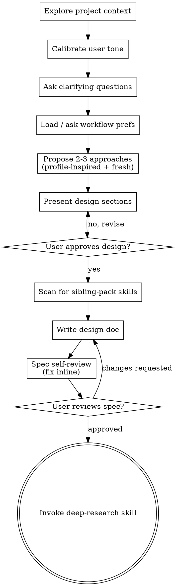

# Brainstorming Ideas Into Designs

Help turn ideas into fully formed designs and specs through natural collaborative dialogue.

Start by understanding the current project context, then ask questions one at a time to refine the idea. Once you understand what you're building, present the design and get user approval.

<HARD-GATE>
Do NOT invoke any implementation skill, write any code, scaffold any project, or take any implementation action until you have presented a design and the user has approved it. This applies to EVERY project regardless of perceived simplicity.
</HARD-GATE>

## Anti-Pattern: "This Is Too Simple To Need A Design"

Every project goes through this process. A todo list, a single-function utility, a config change — all of them. "Simple" projects are where unexamined assumptions cause the most wasted work. The design can be short (a few sentences for truly simple projects), but you MUST present it and get approval.

## Checklist

You MUST create a task for each of these items and complete them in order:

1. **Explore project context** — check files, docs, recent commits (silent machine step)
2. **Calibrate user tone** — read `~/.claude/ultrapowers-user-profile.json` (and repo-level `technicalComfortOverride` if present); if missing, ask the single calibration question (see Tone Calibration section). Result shapes every prompt in subsequent steps.
3. **Ask clarifying questions** — one at a time, understand purpose/constraints/success criteria
4. **Load or ask workflow preferences** — check for saved preferences in .claude/ultrapowers-preferences.json; if missing, ask and save (see Workflow Preferences section below). Phrasing adapts to tone calibration.
5. **Propose 2-3 approaches** — trade-offs across complexity, tooling, and deployment. **Internally consult** `~/.claude/ultrapowers-architecture-defaults.json` (then repo-level override if present): if a profile fits the clarified needs, **adapt its stack to this specific idea** (don't copy it verbatim) and present it as one of the 2-3 options. The other options come from fresh thinking — a simpler alternative, a more ambitious alternative, or a variant with a different deployment strategy. The user picks one or mixes. (See Architecture Profile Matching section for the algorithm and wording.)
6. **Present design** — in sections scaled to their complexity, get user approval after each section
7. **Scan for sibling-pack skills** — match the approved design against `${CLAUDE_SKILL_DIR}/sibling-pack-map.md`; bucket matches into installed vs missing; for missing packs, emit a blocking prompt per pack (see Sibling-Pack Scan section)
8. **Write design doc** — save to `docs/ultrapowers/specs/YYYY-MM-DD-<topic>-design.md` (commit only if user opted in). If tone is `non-technical`, open the spec with a plain-language summary paragraph before the technical body. If skills matched in step 7, include them in a `## Referenced Skills` section inside the spec.
9. **Spec self-review** — quick inline check for placeholders, contradictions, ambiguity, scope (see below)
10. **User reviews written spec** — ask user to review the spec file before proceeding (explain in the tone calibrated for this user)
11. **Transition to research** — invoke deep-research skill to capture current state of the art

## Process Flow



**The terminal state is invoking deep-research.** Do NOT invoke writing-plans, frontend-design, mcp-builder, or any other implementation skill directly. The ONLY skill you invoke after brainstorming is deep-research. The research pipeline (deep-research → skills-audit → skills-creation) will eventually invoke writing-plans.

## The Process

**Understanding the idea:**

- Check out the current project state first (files, docs, recent commits)
- Before asking detailed questions, assess scope: if the request describes multiple independent subsystems (e.g., "build a platform with chat, file storage, billing, and analytics"), flag this immediately. Don't spend questions refining details of a project that needs to be decomposed first.
- If the project is too large for a single spec, help the user decompose into sub-projects: what are the independent pieces, how do they relate, what order should they be built? Then brainstorm the first sub-project through the normal design flow. Each sub-project gets its own spec → plan → implementation cycle.
- For appropriately-scoped projects, ask questions one at a time to refine the idea
- Prefer multiple choice questions when possible, but open-ended is fine too
- Only one question per message - if a topic needs more exploration, break it into multiple questions
- Focus on understanding: purpose, constraints, success criteria

**Exploring approaches:**

- Propose 2-3 different approaches with trade-offs
- Present options conversationally with your recommendation and reasoning
- Lead with your recommended option and explain why

**Presenting the design:**

- Once you believe you understand what you're building, present the design
- Scale each section to its complexity: a few sentences if straightforward, up to 200-300 words if nuanced
- Ask after each section whether it looks right so far
- Cover: architecture, components, data flow, error handling, testing
- Be ready to go back and clarify if something doesn't make sense

**Design for isolation and clarity:**

- Break the system into smaller units that each have one clear purpose, communicate through well-defined interfaces, and can be understood and tested independently
- For each unit, you should be able to answer: what does it do, how do you use it, and what does it depend on?
- Can someone understand what a unit does without reading its internals? Can you change the internals without breaking consumers? If not, the boundaries need work.
- Smaller, well-bounded units are also easier for you to work with - you reason better about code you can hold in context at once, and your edits are more reliable when files are focused. When a file grows large, that's often a signal that it's doing too much.

**Working in existing codebases:**

- Explore the current structure before proposing changes. Follow existing patterns.
- Where existing code has problems that affect the work (e.g., a file that's grown too large, unclear boundaries, tangled responsibilities), include targeted improvements as part of the design - the way a good developer improves code they're working in.
- Don't propose unrelated refactoring. Stay focused on what serves the current goal.

## After the Design

**Documentation:**

- Write the validated design (spec) to `docs/ultrapowers/specs/YYYY-MM-DD-<topic>-design.md`
  - (User preferences for spec location override this default)
- Use elements-of-style:writing-clearly-and-concisely skill if available
- Commit the design document only if the user opted to commit design docs (see Workflow Preferences). Default: do not commit.

**Spec Self-Review:**
After writing the spec document, look at it with fresh eyes:

1. **Placeholder scan:** Any "TBD", "TODO", incomplete sections, or vague requirements? Fix them.
2. **Internal consistency:** Do any sections contradict each other? Does the architecture match the feature descriptions?
3. **Scope check:** Is this focused enough for a single implementation plan, or does it need decomposition?
4. **Ambiguity check:** Could any requirement be interpreted two different ways? If so, pick one and make it explicit.

Fix any issues inline. No need to re-review — just fix and move on.

**User Review Gate:**
After the spec review loop passes, ask the user to review the written spec before proceeding:

> "Spec written to `<path>` (local only, not committed). Please review it and let me know if you want to make any changes before we start the research phase."

Wait for the user's response. If they request changes, make them and re-run the spec review loop. Only proceed once the user approves.

**Research Pipeline:**

- Invoke the deep-research skill to capture the current state of the art
- Do NOT invoke writing-plans or any implementation skill directly
- The research pipeline (deep-research → skills-audit → skills-creation) will invoke writing-plans when ready

## Key Principles

- **One question at a time** - Don't overwhelm with multiple questions
- **Multiple choice preferred** - Easier to answer than open-ended when possible
- **YAGNI ruthlessly** - Remove unnecessary features from all designs
- **Explore alternatives** - Always propose 2-3 approaches before settling
- **Incremental validation** - Present design, get approval before moving on
- **Be flexible** - Go back and clarify when something doesn't make sense

## Workflow Preferences

**Step 4 — Load or ask workflow preferences:**

Read `.claude/ultrapowers-preferences.json` in the project root using the Read tool. If it exists and contains valid JSON, load the values silently and announce:

> "Using saved workflow prefs (auto-commit: on/off, auto-push: on/off, commit docs: on/off). Say 'change prefs' to update."

If the file does not exist or is invalid, ask the user **one** question with the defaults visible:

> "Workflow defaults for this repo: **auto-commit on**, **auto-push on**, **commit design docs off**. Reply `ok` to accept, or tell me what to change (e.g., `no auto-push`, `commit docs too`, `all off`)."

**Defaults:**
- `autoCommit`: **ON** (commit autonomously as tasks complete)
- `autoPush`: **ON** (push to remote after commits)
- `commitDesignDocs`: **OFF** (design specs/research briefs stay local)
- `suggestSiblingPacks.dev`: **ON** (suggest installing `ultrapowers-dev` when relevant and missing)
- `suggestSiblingPacks.business`: **ON** (suggest installing `ultrapowers-business` when relevant and missing)

**Deterministic reply parsing** (apply in order; multiple modifiers combine):

| User reply | Resulting change |
|---|---|
| `ok` / `yes` / `accept` / empty | all defaults as-is |
| `no auto-commit` / `manual commits` | `autoCommit: false` |
| `no auto-push` / `manual push` | `autoPush: false` |
| `commit docs` / `include design docs` | `commitDesignDocs: true` |
| `all off` | `autoCommit: false`, `autoPush: false`, `commitDesignDocs: false` |
| `all on` | `autoCommit: true`, `autoPush: true`, `commitDesignDocs: true` |

Combined example: `no auto-push, commit docs` → `autoPush: false`, `commitDesignDocs: true`.

If the reply is ambiguous (e.g., `push but not commit`), ask **one** targeted follow-up:

> "To confirm: auto-push on, auto-commit off, commit docs off — correct?"

Do not guess.

**Schema written to `.claude/ultrapowers-preferences.json`:**

```json
{
  "autoCommit": true,
  "autoPush": true,
  "commitDesignDocs": false,
  "suggestSiblingPacks": {
    "dev": true,
    "business": true
  }
}
```

The `suggestSiblingPacks` object is additive and controls whether Step 6a (below) fires blocking "install missing sibling pack" prompts. If the file is missing this key, treat both flags as `true`. If a user replies `stop suggesting ultrapowers-dev` (or the flag is written via the sibling-pack scan step), persist `suggestSiblingPacks.dev: false` without touching other fields.

If `.claude/` directory doesn't exist, create it. Suggest adding `.claude/ultrapowers-preferences.json` to `.gitignore` if not already ignored.

All downstream skills (`writing-plans`, `subagent-driven-development`, `executing-plans`, `finishing-a-development-branch`, `project-setup`) read this file and respect the values. Unknown keys (like `suggestSiblingPacks` in older consumers) are ignored gracefully. If the file is missing, fall back to defaults documented above (all three workflow flags ON for auto-commit/auto-push, OFF for commitDesignDocs; both `suggestSiblingPacks` flags ON).

## Tone Calibration

**Step 2 — Calibrate user tone:**

The same design conversation should sound very different with a backend engineer than with a founder who doesn't write code. We're still the technical experts — we still recommend the best stack — but the user is describing what they want in their own words, so the language we use back to them has to match their comfort level.

### Lookup order

1. Repo override: `<repo>/.claude/ultrapowers-preferences.json` → `technicalComfortOverride` field (if present, wins).
2. User-level: `~/.claude/ultrapowers-user-profile.json` → `technicalComfort` field.
3. Neither set → ask the first-run question (below), save answer, proceed.

### First-run question

Ask exactly once, as the **first user-facing question** of the session (before workflow prefs, before clarifying questions):

> "Quick calibration so I match your style — are you **technical** (developer, engineer, tech PM) or **non-technical** (creator, founder, business owner, designer)? Reply `technical` or `non-technical`, or describe yourself in your own words and I'll infer."

**Parsing:**

| Reply contains | Save as |
|---|---|
| `technical` / `dev` / `engineer` / `pm` / `technical lead` / `cto` | `"technical"` |
| `non-technical` / `non tech` / `creator` / `founder` / `owner` / `designer` / `marketer` / `not a dev` | `"non-technical"` |
| Free-form description — infer from context (mentions of code, frameworks, APIs → technical; mentions of business, product, users-without-tech-details → non-technical) | best guess, then confirm in one line: *"Going with `<bucket>` — say 'recalibrate' any time to change."* |
| Ambiguous / blank | default to `"technical"` and announce: *"Defaulting to technical tone — say 'explain simpler' any time to switch."* |

### Saving

Write to `~/.claude/ultrapowers-user-profile.json`:

```json
{
  "technicalComfort": "technical"
}
```

If `~/.claude/` doesn't exist, create it. The file is user-level on purpose — the user's comfort level doesn't change between projects. Use a repo-level `technicalComfortOverride` only when a specific project needs a different calibration (e.g., you're helping a non-technical collaborator).

### What `technical` mode does

- Use stack / framework / library names directly: "Astro + Tailwind v4 + Drizzle + Neon."
- Discuss tradeoffs with precise vocabulary: SSR vs SSG, cold-start latency, query N+1, cache invalidation.
- Ask questions at the layer the user operates: "Do you want optimistic updates or pessimistic?"
- Design docs, plans, and research briefs — already technical, no change.

### What `non-technical` mode does

- Still name the stack, but add a short parenthetical the first time: "Astro (a modern framework for fast content sites)."
- Frame tradeoffs as **business outcomes**: speed, cost, future maintenance, flexibility — not technical internals.
- Translate clarifying questions into plain language:
  - Instead of: *"Should this page be SSR or SSG?"*
  - Say: *"Should every visitor see the same page, or personalized content? Static pages load faster and cost less; dynamic pages let you personalize but are slightly slower."*
- Rephrase the workflow-prefs prompt:
  - Instead of: *"auto-commit, auto-push, commit design docs"*
  - Say: *"Workflow defaults: save your progress automatically, share to GitHub automatically, keep design docs private. Reply `ok` or tell me what to change."*
- When writing the design doc (step 10), **prepend a plain-language summary paragraph** at the top of the spec explaining what's being built in business terms. The technical body follows — that part stays technical because the audience is the implementer.

### What stays the same in both modes

- The stack recommendation itself. We pick the best tools regardless of the user's comfort — that's our job as the technical expert supporting the build.
- The implementation plan and research brief are always technical (implementer-facing).
- The architecture-profile match. We still suggest the right profile; only the *presentation* of that profile changes in tone.

### Override at any time

User can say:

- `explain simpler` / `talk less technical` / `I'm not a dev` → switch to `non-technical`, overwrite the file.
- `talk more technical` / `use technical terms` / `I'm a dev` → switch to `technical`, overwrite the file.
- `recalibrate` → re-ask the first-run question.

When switching, announce the change in one line: *"Got it — switching to plain-language mode. Say 'talk more technical' any time to switch back."*

## Architecture Profile Matching

**Used during Step 5 — Propose 2-3 approaches:**

**The user's design wins.** Profiles are a library of tool choices that have worked well on similar past projects. They exist to seed **one of the 2-3 approaches** we propose — *adapted* to the current idea, never copy-pasted. The other approaches come from fresh thinking so the user sees genuine alternatives in complexity, tooling, and deployment strategy.

### Setup (first-run only)

Before generating approaches, check:

1. Read `~/.claude/ultrapowers-architecture-defaults.json` (user-level, baseline) and `<repo>/.claude/ultrapowers-architecture-defaults.json` (repo-level override — replaces user-level if present).
2. If neither file exists AND this is the first run after the profiles feature was added, ask **once per user**:
   > "I don't see your architecture defaults file at `~/.claude/ultrapowers-architecture-defaults.json`. I can seed one with two profiles (marketing/content site + SaaS product app) based on your current reference projects, which I'll consult when proposing design approaches. Want me to create it? (`yes` / `skip`)"

   On `yes`: write the seed file using the two profiles from `${CLAUDE_SKILL_DIR}/architecture-profile-matching.md`. On `skip`: proceed without profile input for this session; the 2-3 approaches all come from fresh thinking.

### Using profiles when generating approaches

3. Apply the matching algorithm in `${CLAUDE_SKILL_DIR}/architecture-profile-matching.md` against the clarifying-question answers (what the user is actually building). Match on the described *needs*, not just exact keywords.
4. If one profile fits: **adapt its stack** to the user's specific idea — drop irrelevant tools, add what the idea needs, adjust deployment to fit constraints (budget, audience size, existing infra). This becomes **one** of the 2-3 approaches you propose.
5. Generate 1-2 other approaches from fresh thinking — typically a simpler option (less infra, faster to ship) and/or a more ambitious option (more capability, more complexity).
6. Present all approaches with clear differentiation: complexity, tooling, deployment, trade-offs. Name the profile-inspired approach plainly (e.g., *"**Approach 1** — similar to my past marketing sites: Astro + Netlify + Neon/Drizzle. Adapted here to include {idea-specific additions}."*) so the user understands the reference point without being pushed toward it.

### Never

- **Never** force a profile's stack into an approach. If adapting makes the profile unrecognizable, drop it and propose from fresh thinking.
- **Never** auto-edit the defaults file. Any change to profiles (including seed write) requires explicit user consent.
- **Never** present only the profile-based approach as if it were "the" answer. The user must see at least one genuine alternative.

## Sibling-Pack Scan

**Step 8 — Scan for sibling-pack skills (runs after design is approved and profile inspiration has been offered, before writing the spec):**

1. Read `${CLAUDE_SKILL_DIR}/sibling-pack-map.md`.
2. Extract signals from the approved design: architecture section, tech stack mentions, domain descriptions, plus any tools adopted from the step 7 profile inspiration.
3. For each signal, look up matching skills in both the `ultrapowers-dev` and `ultrapowers-business` tables.
4. For each matched skill, scan the session's available-skills list (injected as `<system-reminder>`) for the corresponding prefix:
   - `ultrapowers-dev:<name>` present → **installed match** for `ultrapowers-dev`.
   - `ultrapowers-business:<name>` present → **installed match** for `ultrapowers-business`.
   - Pack prefix entirely absent from available-skills → **missing pack** (candidate for install prompt).
5. Handle results:
   - **Installed matches** (any count) → append a `## Referenced Skills` section to the spec (written in step 9) listing them with one-line rationale per skill. Done silently — no user prompt.
   - **Missing pack, relevant AND `suggestSiblingPacks.<pack>: true`** → emit a blocking prompt, one per missing pack, sequentially. Do not combine packs into a single prompt.

**Blocking prompt template (one per missing pack):**

> "This project looks like it would benefit from the **ultrapowers-{dev|business}** pack. Detected signals: `{signal1}`, `{signal2}`, `{signal3}`. It's optional but would give the implementation plan access to current best-practice skills. Options:
>
> 1. **Install** — I'll pause while you run `/plugin install ultrapowers-{dev|business}@ultrapowers` (or use the interactive `/plugin` menu). When done, say `installed` and I'll re-scan.
> 2. **Skip** — proceed without; I won't reference these skills in the spec.
> 3. **Skip and stop suggesting** — sets `suggestSiblingPacks.{dev|business}: false` in `.claude/ultrapowers-preferences.json` so I don't suggest this pack again in this repo."

Wait for user response:
- `installed` → call `/reload-plugins` if needed, re-read the available-skills list (ask the user to paste the updated list if not automatically visible), re-bucket matches, and proceed. If the pack still doesn't appear, ask the user to verify the install and fall back to `skip` after one retry.
- `skip` → drop matches for this pack for this session; don't write to prefs.
- `skip and stop suggesting` → read current `.claude/ultrapowers-preferences.json`, set `suggestSiblingPacks.<pack>: false`, write it back (preserving all other keys), drop matches for this session.

