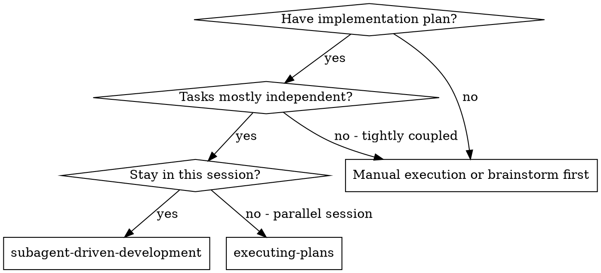
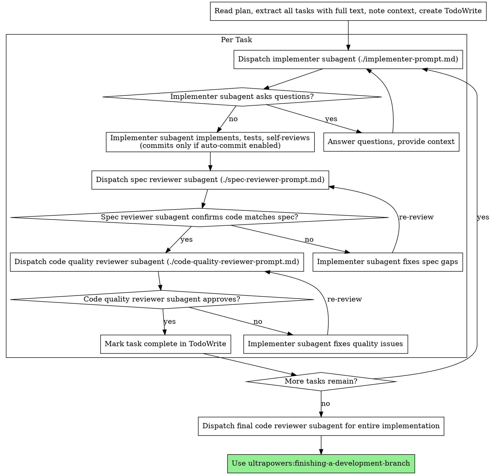

# Subagent-Driven Development

Execute plan by dispatching fresh subagent per task, with two-stage review after each: spec compliance review first, then code quality review.

**Why subagents:** You delegate tasks to specialized agents with isolated context. By precisely crafting their instructions and context, you ensure they stay focused and succeed at their task. They should never inherit your session's context or history — you construct exactly what they need. This also preserves your own context for coordination work.

**Core principle:** Fresh subagent per task + two-stage review (spec then quality) = high quality, fast iteration

## When to Use



**vs. Executing Plans (parallel session):**
- Same session (no context switch)
- Fresh subagent per task (no context pollution)
- Two-stage review after each task: spec compliance first, then code quality
- Faster iteration (no human-in-loop between tasks)

## The Process



## Scope-Adjusted Review

Not every task needs implementer + spec reviewer + quality reviewer + final reviewer. Calibrate review depth to task scope:

| Tier | Fits when | Dispatches per task |
|---|---|---|
| **A. Trivial** | single-file, logic-bearing change ≤10 LOC (e.g. one-line validation, tightening a regex) | implementer + **one combined reviewer** (merge spec + quality into a single prompt) |
| **B. Standard** | typical task from a plan — new function, handler, component, migration | current two-stage: implementer → spec reviewer → quality reviewer |
| **C. Complex** | multi-file architectural change, cross-cutting concern, new subsystem | standard + **one extra architecture reviewer** to catch layering/coupling issues |

**Final code reviewer for entire implementation:** skip it when the plan has exactly one task — the per-task reviews already covered the full change. Dispatch it only when multiple tasks compose into something the individual reviews could not catch in isolation.

Trivial-tier tasks in a plan are uncommon. If the plan decomposition produced many tier-A tasks, consider whether the plan is over-decomposed rather than under-reviewing. Tier-B is the default; tier-A is the explicit exception.

### Controller judgment on ceremony

The two-stage review (spec + code-quality) per task exists for a reason — it catches correctness and quality issues early. But for **trivial mechanical tasks** (single bash command, pasting fixed content into a new file, read-only grep checks), the controller can verify directly and skip the reviewer dispatches.

Rule of thumb: if the task has no judgment, no domain reasoning, and no "did the implementer build the right thing" ambiguity, verify inline. Dispatch subagents when there's real work being delegated. **Never skip reviews for tasks that edit existing logic-bearing code** — even a one-line change to a critical handler gets both reviews.

## Workflow Preferences

Before dispatching implementer subagents, read `.claude/ultrapowers-preferences.json` in the project root. If it exists, use its values for `autoCommit` and `autoPush`. Pass these to implementer subagents so they know whether to commit after each task and whether to push. If the file is missing, default to `autoCommit: true`, `autoPush: true` (matches the `brainstorming` skill and README 1.x defaults).

### Preferences Propagation

The controller plumbs prefs through each dispatched subagent. Inject the resolved values explicitly — don't rely on subagents re-reading the prefs file.

| Prompt file | Variables injected | Behavior by value |
|---|---|---|
| `./implementer-prompt.md` | `autoCommit`, `autoPush` | `autoCommit: true` → implementer commits at end of task. `autoCommit: false` → implementer **stages** changes (`git add`) but does not commit; the controller decides commit boundaries later. `autoPush` is implementer-ignored (only finishing-a-development-branch pushes). |
| `./spec-reviewer-prompt.md` | (none) | Read-only review; no commit/push side effects. |
| `./code-quality-reviewer-prompt.md` | (none) | Read-only review; no commit/push side effects. |

**Contract for `autoCommit: false`:** the implementer's `Report Format` still reports DONE with the staged diff. Reviewers run against the staged state, not against a commit. The controller — or `finishing-a-development-branch` at the end — is responsible for deciding commit granularity. Do not force implementers to commit when the user opted out.

**Verifying the contract:** if you change the three prompt files, re-read this subsection to confirm the behavior still matches. When in doubt, prefer documenting the divergence here over silently changing prompt semantics.

## Pre-Implementation Skills Check

Before dispatching the first implementer subagent, verify that the plan includes **skill annotations** for each task. If a task references skills, confirm those skills are available (installed plugin or local `.claude/skills/` file).

If skills are missing at this point, **stop and run the skills-audit skill** before proceeding. This catches cases where the audit was skipped or new gaps emerged during planning.

When dispatching implementer subagents, include the relevant skill names in their prompt so they can invoke them during implementation.

## Model Selection

Use the least powerful model that can handle each role to conserve cost and increase speed.

**Mechanical implementation tasks** (isolated functions, clear specs, 1-2 files): use a fast, cheap model. Most implementation tasks are mechanical when the plan is well-specified.

**Integration and judgment tasks** (multi-file coordination, pattern matching, debugging): use a standard model.

**Architecture, design, and review tasks**: use the most capable available model.

**Task complexity signals:**
- Touches 1-2 files with a complete spec → cheap model
- Touches multiple files with integration concerns → standard model
- Requires design judgment or broad codebase understanding → most capable model

## Handling Implementer Status

Implementer subagents report one of four statuses. Handle each appropriately:

**DONE:** Proceed to spec compliance review.

**DONE_WITH_CONCERNS:** The implementer completed the work but flagged doubts. Read the concerns before proceeding. If the concerns are about correctness or scope, address them before review. If they're observations (e.g., "this file is getting large"), note them and proceed to review.

**NEEDS_CONTEXT:** The implementer needs information that wasn't provided. Provide the missing context and re-dispatch.

**BLOCKED:** The implementer cannot complete the task. Assess the blocker:
1. If it's a context problem, provide more context and re-dispatch with the same model
2. If the task requires more reasoning, re-dispatch with a more capable model
3. If the task is too large, break it into smaller pieces
4. If the plan itself is wrong, escalate to the human

**Never** ignore an escalation or force the same model to retry without changes. If the implementer said it's stuck, something needs to change.

## Prompt Templates

- `./implementer-prompt.md` - Dispatch implementer subagent
- `./spec-reviewer-prompt.md` - Dispatch spec compliance reviewer subagent
- `./code-quality-reviewer-prompt.md` - Dispatch code quality reviewer subagent

## Example Workflow

```
You: I'm using Subagent-Driven Development to execute this plan.

[Read plan file once: docs/ultrapowers/plans/feature-plan.md]
[Extract all 5 tasks with full text and context]
[Create TodoWrite with all tasks]

Task 1: Hook installation script

[Get Task 1 text and context (already extracted)]
[Dispatch implementation subagent with full task text + context]

Implementer: "Before I begin - should the hook be installed at user or system level?"

You: "User level (~/.config/ultrapowers/hooks/)"

Implementer: "Got it. Implementing now..."
[Later] Implementer:
  - Implemented install-hook command
  - Added tests, 5/5 passing
  - Self-review: Found I missed --force flag, added it
  - Committed

[Dispatch spec compliance reviewer]
Spec reviewer: ✅ Spec compliant - all requirements met, nothing extra

[Get git SHAs, dispatch code quality reviewer]
Code reviewer: Strengths: Good test coverage, clean. Issues: None. Approved.

[Mark Task 1 complete]

Task 2: Recovery modes

[Get Task 2 text and context (already extracted)]
[Dispatch implementation subagent with full task text + context]

Implementer: [No questions, proceeds]
Implementer:
  - Added verify/repair modes
  - 8/8 tests passing
  - Self-review: All good
  - Committed

[Dispatch spec compliance reviewer]
Spec reviewer: ❌ Issues:
  - Missing: Progress reporting (spec says "report every 100 items")
  - Extra: Added --json flag (not requested)

[Implementer fixes issues]
Implementer: Removed --json flag, added progress reporting

[Spec reviewer reviews again]
Spec reviewer: ✅ Spec compliant now

[Dispatch code quality reviewer]
Code reviewer: Strengths: Solid. Issues (Important): Magic number (100)

[Implementer fixes]
Implementer: Extracted PROGRESS_INTERVAL constant

[Code reviewer reviews again]
Code reviewer: ✅ Approved

[Mark Task 2 complete]

...

[After all tasks]
[Dispatch final code-reviewer]
Final reviewer: All requirements met, ready to merge

Done!
```

## Advantages

**vs. Manual execution:**
- Subagents follow TDD naturally
- Fresh context per task (no confusion)
- Parallel-safe (subagents don't interfere)
- Subagent can ask questions (before AND during work)

**vs. Executing Plans:**
- Same session (no handoff)
- Continuous progress (no waiting)
- Review checkpoints automatic

**Efficiency gains:**
- No file reading overhead (controller provides full text)
- Controller curates exactly what context is needed
- Subagent gets complete information upfront
- Questions surfaced before work begins (not after)

**Quality gates:**
- Self-review catches issues before handoff
- Two-stage review: spec compliance, then code quality
- Review loops ensure fixes actually work
- Spec compliance prevents over/under-building
- Code quality ensures implementation is well-built

**Cost:**
- More subagent invocations (implementer + 2 reviewers per task)
- Controller does more prep work (extracting all tasks upfront)
- Review loops add iterations
- But catches issues early (cheaper than debugging later)

## Red Flags

**Never:**
- Start implementation on main/master branch without explicit user consent
- Skip reviews (spec compliance OR code quality)
- Proceed with unfixed issues
- Dispatch multiple implementation subagents in parallel (conflicts). `ultrapowers:dispatching-parallel-agents` is scoped to **investigation / debugging fan-out** only — read-only evidence gathering across independent failures. It is never a substitute for serial implementation here.
- Make subagent read plan file (provide full text instead)
- Skip scene-setting context (subagent needs to understand where task fits)
- Ignore subagent questions (answer before letting them proceed)
- Accept "close enough" on spec compliance (spec reviewer found issues = not done)
- Skip review loops (reviewer found issues = implementer fixes = review again)
- Let implementer self-review replace actual review (both are needed)
- **Start code quality review before spec compliance is ✅** (wrong order)
- Move to next task while either review has open issues

**If subagent asks questions:**
- Answer clearly and completely
- Provide additional context if needed
- Don't rush them into implementation

**If reviewer finds issues:**
- Implementer (same subagent) fixes them
- Reviewer reviews again
- Repeat until approved
- Don't skip the re-review

**If subagent fails task:**
- Dispatch fix subagent with specific instructions
- Don't try to fix manually (context pollution)

## Integration

**Required workflow skills:**
- **ultrapowers:using-git-worktrees** - REQUIRED: Set up isolated workspace before starting
- **ultrapowers:writing-plans** - Creates the plan this skill executes
- **ultrapowers:requesting-code-review** - Code review template for reviewer subagents
- **ultrapowers:verification-before-completion** - REQUIRED: Invoke before marking any task complete and before handing off to finishing-a-development-branch. No completion claim without fresh verification evidence.
- **ultrapowers:finishing-a-development-branch** - Complete development after all tasks

**Subagents should use:**
- **ultrapowers:test-driven-development** - Subagents follow TDD for each task

**Alternative workflow:**
- **ultrapowers:executing-plans** - Use for parallel session instead of same-session execution
